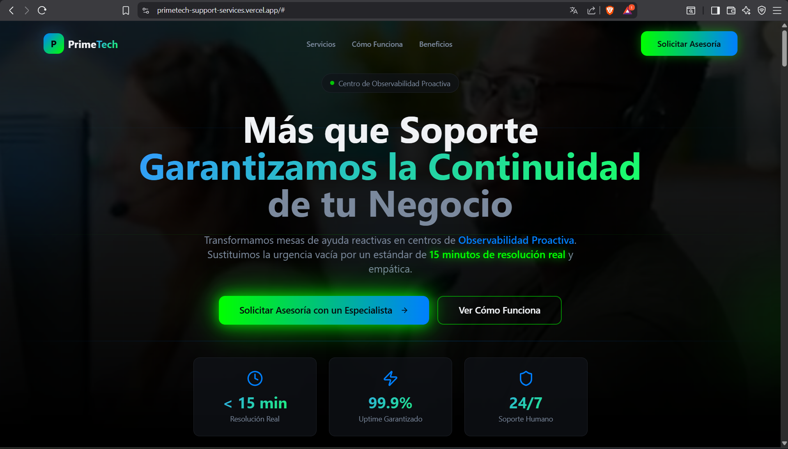
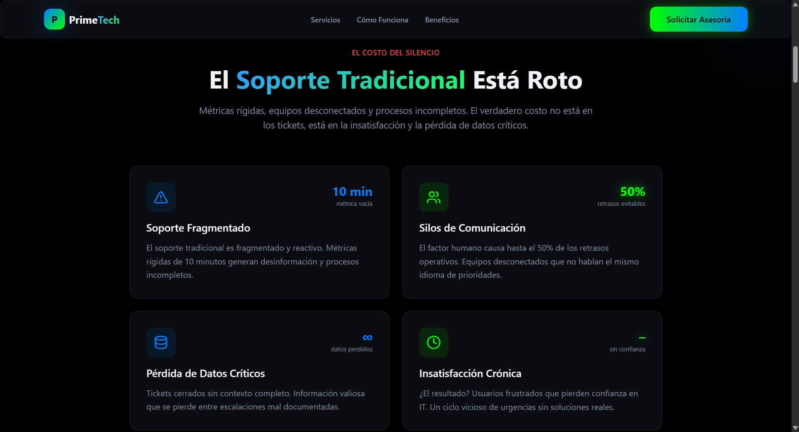
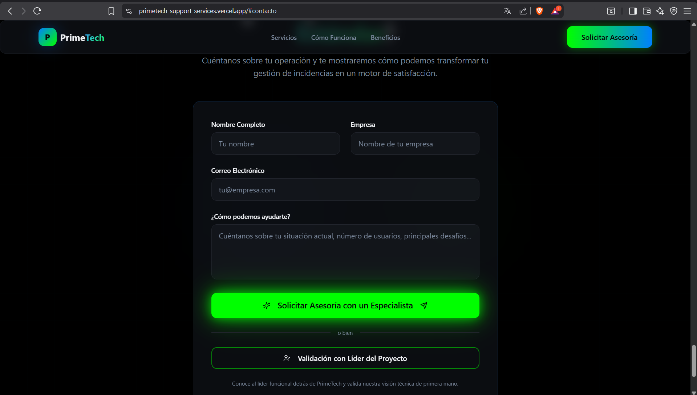

#  PrimeTech Support Services

---

## 1. Información general

- **Nombre del proyecto:** PrimeTech Support Services  
- **Nombre del estudiante / Líder del proyecto:** Jeffry Santiago Casas Hernandez  
- **Curso:** CALIDAD SERVICIO DE SOFTWARE 3 
- **Fecha:** 28/02/2026

---

## 2. Descripción del proyecto

PrimeTech Support Services es una landing page profesional diseñada para presentar servicios especializados de soporte técnico y gestión de incidencias empresariales.

El objetivo principal del proyecto es ofrecer una propuesta clara, moderna y orientada a la conversión, permitiendo a las empresas conocer cómo podemos transformar su operación de soporte en un sistema eficiente, estructurado y centrado en la satisfacción del cliente.

La landing incluye información estratégica sobre:

- Servicios ofrecidos
- Metodología de trabajo
- Beneficios principales
- Llamados a la acción (CTA)
- Formulario de contacto
- Redirección directa al líder del proyecto mediante tarjeta de presentación digital

### ¿Qué hace el proyecto?

- Presenta una propuesta profesional de soporte técnico.
- Permite a los usuarios conocer el modelo de trabajo.
- Facilita la solicitud de asesoría personalizada.
- Genera confianza mediante la validación con el líder del proyecto.

### ¿Para quién está pensado?

- Empresas que necesitan optimizar su mesa de ayuda.
- Negocios que requieren soporte técnico profesional.
- Organizaciones que buscan mejorar tiempos de respuesta.
- Emprendimientos que desean estructurar su soporte tecnológico.

---

## 3. Tecnologías utilizadas

- HTML5  
- CSS3  
- JavaScript  
- Tailwind CSS  
- Git  
- GitHub  
- Vercel (Despliegue del proyecto)

---

## 4. Estructura del proyecto

```plaintext
/primetech-support-services
│── index.html
│── /css
│   └── styles.css
│── /js
│   └── main.js
│── /images
│   ├── hero.png
│   ├── servicios.png
│   ├── formulario.png
│── README.md
```

### Explicación de la estructura

- **index.html:** Archivo principal donde se estructura toda la landing page.
- **/css:** Carpeta que contiene los estilos personalizados del proyecto.
- **/js:** Carpeta que contiene los scripts para interactividad y validaciones.
- **README.md:** Documento explicativo del proyecto.

---

## 5. Funcionalidades

### 🔹 1. Página principal (Landing Page)

- Sección Hero con mensaje de conversión.
- Navegación superior con enlaces a:
  - Servicios
  - Cómo funciona
  - Beneficios
- Botón principal de “Solicitar Asesoría”.
- Diseño oscuro profesional con enfoque tecnológico.

---

### 🔹 2. Sección de Servicios

- Explicación clara de los servicios de soporte ofrecidos.
- Presentación estructurada de soluciones tecnológicas.
- Enfoque en eficiencia operativa y satisfacción del cliente.

---

### 🔹 3. Sección “Cómo Funciona”

- Explicación del proceso de implementación del servicio.
- Flujo estructurado desde diagnóstico hasta optimización.
- Orientado a mostrar claridad y profesionalismo.

---

### 🔹 4. Sección de Beneficios

- Mejora de tiempos de respuesta.
- Optimización de procesos.
- Mayor satisfacción del cliente.
- Soporte técnico estructurado.
- Profesionalización del servicio de incidencias.

---

### 🔹 5. Formulario de contacto

Ubicado en la sección final de la landing.

Permite al usuario ingresar:

- Nombre completo  
- Empresa  
- Correo electrónico  
- Descripción de la necesidad  

Incluye:

- Validación básica de campos.
- Botón principal de envío.
- Diseño visual enfocado en conversión.

---

### 🔹 6. Redirección al Líder del Proyecto

El botón **“Validación con Líder del Proyecto”** redirecciona a la tarjeta de presentación digital del líder:

  https://tarjeta-presentacion-jeffry-hernand.vercel.app/

Esto permite:

- Generar confianza.
- Humanizar el servicio.
- Facilitar contacto directo.
- Reforzar la credibilidad del proyecto.

---

### 🔹 7. Diseño Responsive

- Adaptable a escritorio.
- Compatible con tablet.
- Optimizado para dispositivos móviles.
- Correcta visualización en diferentes resoluciones.

---

### 🔹 8. Experiencia Visual Moderna

- Paleta de colores profesional (modo oscuro).
- Botones con efectos visuales llamativos.
- Animaciones suaves.
- Jerarquía visual clara.
- Enfoque estratégico en conversión.

---

## 6. Capturas de pantalla

```markdown




```

- Sección principal (Hero).
- Sección de servicios.
- Formulario de contacto.
---

## 7. Cómo ejecutar el proyecto

Sigue los siguientes pasos para ejecutar el proyecto en tu entorno local:

### 🔹 Requisitos previos

- Tener instalado Node.js
- Tener instalado Git
- Tener instalado npm (incluido con Node.js)

---

### 🔹 1. Crear una carpeta para el proyecto (Opcional)

```bash
mkdir PrimeTech-Support-Services
cd PrimeTech-Support-Services
```

---

### 🔹 2. Clonar el repositorio desde GitHub

Abrir Git Bash o la terminal y ejecutar:

```bash
git clone https://github.com/JeffryCasasHernandez/PrimeTech-Support-Services.git
```

Luego ingresar a la carpeta del proyecto:

```bash
cd PrimeTech-Support-Services
```

---

### 🔹 3. Instalar dependencias

Antes de ejecutar el proyecto es necesario instalar las dependencias:

```bash
npm install
```

Esto instalará todos los paquetes necesarios definidos en el archivo `package.json`.

---

### 🔹 4. Inicializar el proyecto (si aplica)

En caso de necesitar inicializar npm manualmente:

```bash
npm init 
```

> Nota: Este paso solo es necesario si el proyecto no tiene `package.json`.  
> Si ya existe, se puede omitir.

---

### 🔹 5. Ejecutar el servidor de desarrollo

Para iniciar el proyecto en modo desarrollo:

```bash
npm run dev
```

---

### 🔹 6. Abrir en el navegador

Una vez ejecutado el comando anterior, la terminal mostrará una URL similar a:

```
http://localhost:8081/
```

Abrir esa dirección en el navegador para visualizar la landing page funcionando en entorno local.

---

### 🔹 Repositorio oficial

 https://github.com/JeffryCasasHernandez/PrimeTech-Support-Services.git

---

---

## 8. Mejoras futuras

- Integración con backend real para envío automático de correos.
- Implementación de sistema de tickets.
- Conexión con CRM.
- Integración con WhatsApp Business.
- Panel administrativo.
- Métricas y analítica avanzada.
- Automatización de respuestas.
- Implementación de base de datos.

---

#  Enlaces del proyecto

-  Landing Principal:  
  https://primetech-support-services.vercel.app/

-  Tarjeta de Presentación del Líder:  
  https://tarjeta-presentacion-jeffry-hernand.vercel.app/

---

#  Estado del Proyecto

Proyecto funcional desplegado en Vercel.  
Diseñado como propuesta profesional de soporte técnico empresarial.

---

---

# Autor

Jeffry Santiago Casas Hernandez  
Líder del Proyecto – PrimeTech Support Services

---

# Despliegue

Landing en producción:
https://primetech-support-services.vercel.app/

---

---

#  Licencia

Proyecto desarrollado con fines académicos y de portafolio profesional.